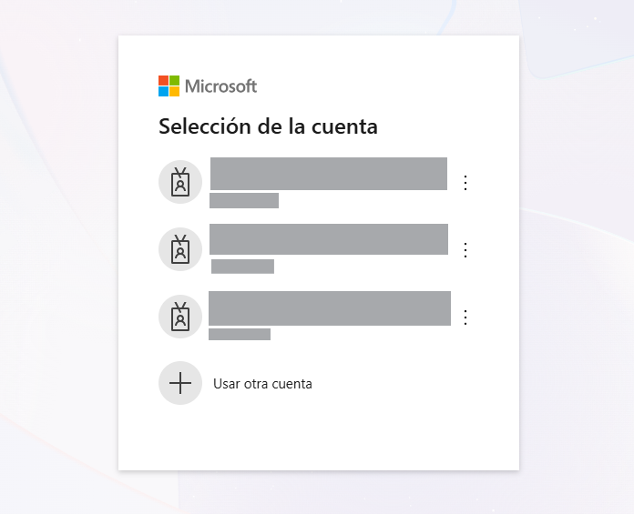
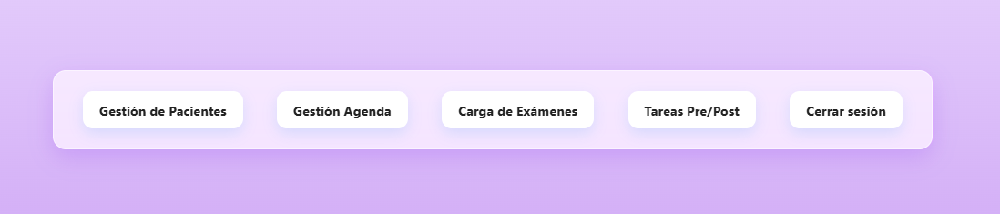
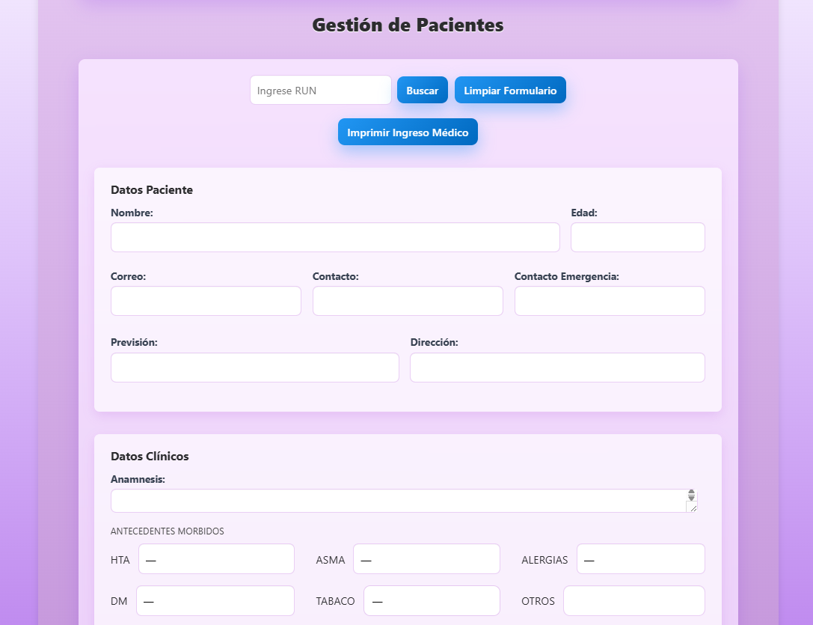
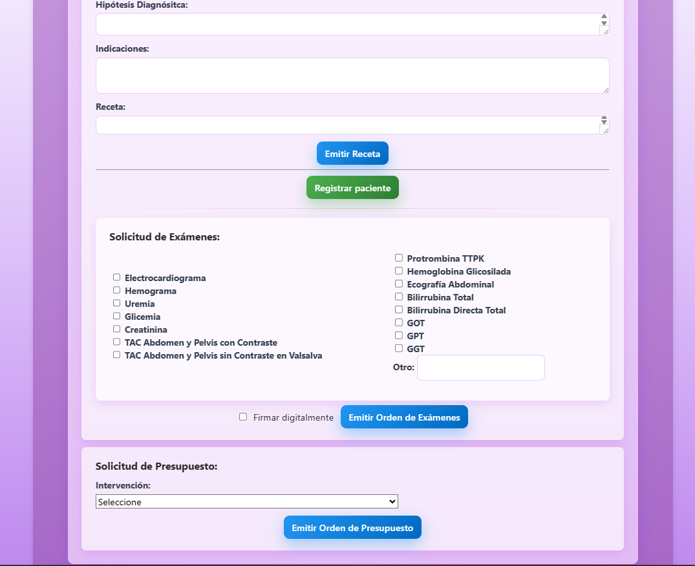

# 🏥 Plataforma de Gestión Clínica

Plataforma web de gestión clínica desarrollada para una clienta real, integrada con servicios cloud de Microsoft 365 para centralizar la gestión de pacientes, agenda, documentación y procesos administrativos.

Este proyecto fue desarrollado para una **clienta real**, a partir del levantamiento de sus necesidades y de los procesos utilizados diariamente en su consulta.

## 🎯 Objetivo del proyecto

Digitalizar y centralizar procesos que anteriormente se realizaban de forma manual o mediante distintas herramientas, facilitando el trabajo coordinado entre la médica y su secretaria.

## 🔎 Contexto y problema

La plataforma nace de una necesidad real dentro de una consulta médica: centralizar y facilitar procesos administrativos que requieren coordinación entre la médica y su asistente.

La gestión incluía distintas tareas, como el registro y consulta de pacientes, organización de la agenda, generación de documentación clínica y seguimiento de atenciones. La información y los procesos se encontraban distribuidos entre distintas herramientas, lo que hacía necesario contar con una solución que permitiera gestionarlos desde un único lugar.

A partir de reuniones y conversaciones con la clienta, se levantaron los requerimientos y se desarrolló progresivamente una plataforma adaptada a su forma real de trabajo.

## 👩‍💻 Mi rol en el proyecto

Estuve a cargo del desarrollo de la solución, participando desde el levantamiento de requerimientos hasta la implementación y mejora continua de la plataforma.

Mis principales responsabilidades incluyeron:

- Levantamiento y análisis de requerimientos junto a la clienta.
- Diseño de la solución y definición de funcionalidades.
- Desarrollo frontend y backend de la plataforma.
- Implementación de autenticación mediante Microsoft Entra ID.
- Integración con Microsoft Graph y Microsoft Lists / SharePoint.
- Desarrollo de módulos para gestión de pacientes, agenda y documentación.
- Validaciones y manejo de reglas de negocio.
- Pruebas funcionales y resolución de incidencias.
- Incorporación de mejoras a partir del uso real y feedback de las usuarias.

## ⚙️ Funcionalidades principales

### 🔐 Autenticación y acceso
- Inicio de sesión mediante Microsoft Entra ID.
- Acceso restringido a usuarios autorizados.
- Integración con Microsoft Graph para acceder a servicios de Microsoft 365.

### 👤 Gestión de pacientes
- Búsqueda y consulta de pacientes mediante RUT.
- Acceso centralizado a la información registrada del paciente.
- Generación automática de documentos en formato PDF a partir de la información almacenada en la plataforma.
- Emisión de ingreso médico, recetas médicas, órdenes de exámenes y órdenes de presupuesto.

### 📅 Gestión de agenda
- Búsqueda de pacientes mediante RUT y asociación de citas.
- Agendamiento según tipo de atención, incluyendo controles y cirugías.
- Selección de fecha y horario de atención.
- Cálculo dinámico de disponibilidad, excluyendo automáticamente los horarios que ya se encuentran ocupados.
- Aplicación de validaciones y reglas de negocio durante el proceso de agendamiento.
- Creación automática de eventos en el calendario de la clienta mediante Microsoft Graph.
- Visualización de las citas asociadas a cada paciente.
- Confirmación y cancelación de citas desde la plataforma.
- La información de agenda también es utilizada por procesos automatizados de comunicaciones pre y postoperatorias.

### 🧪 Gestión de exámenes
- Búsqueda de pacientes mediante RUT.
- Visualización de los exámenes asociados al paciente.
- Seguimiento del estado de revisión de cada examen.
- Actualización del estado desde **No revisado** a **Revisado**.

### ✅ Gestión de tareas Pre/Post operatorias
- Búsqueda de pacientes mediante RUT.
- Generación automática del **Consentimiento Informado** en formato PDF.
- Consulta y validación de la cirugía agendada y confirmada del paciente para completar automáticamente la información requerida en el documento.
- Generación automática de la **Escala de Caprini** como parte de la documentación preoperatoria.
- Gestión y seguimiento de órdenes de presupuesto.
- Registro de contactabilidad de pacientes.
- Actualización del estado de las órdenes de presupuesto.
- Visualización y filtrado de órdenes pendientes de gestión.
- Exportación a Excel de órdenes en estado **No presupuestado** para facilitar su seguimiento y contactabilidad.

### 🔄 Automatización de comunicaciones Pre/Post operatorias
- Ejecución programada mediante workflows de **GitHub Actions**.
- Acceso seguro a la información de agenda mediante autenticación por token.
- Consulta de citas y cirugías para identificar pacientes que cumplen las condiciones de envío.
- Aplicación de reglas de negocio para determinar cuándo corresponde ejecutar una comunicación pre o postoperatoria.
- Procesamiento automático de los envíos asociados a cada paciente.
- Registro del **SID del mensaje** y de la **fecha de envío** para mantener trazabilidad del proceso y evitar envíos duplicados.

  
## 🖥️ Vista de la plataforma

### 🔐 Inicio de sesión

La plataforma utiliza Microsoft Entra ID para autenticar a los usuarios autorizados.

  

### 🏠 Pantalla principal

Desde la vista principal se accede a los módulos de gestión de pacientes, agenda, exámenes y tareas pre/postoperatorias.

  

### 👤 Gestión de pacientes

El módulo permite buscar pacientes mediante RUT y administrar su información desde una ficha centralizada. Los datos pueden ser consultados, editados y actualizados mediante formularios que incorporan distintos tipos de entrada, validaciones y reglas de negocio.

Desde la misma interfaz es posible generar documentación clínica y administrativa en formato PDF utilizando la información registrada del paciente, incluyendo ingreso médico, recetas, órdenes de exámenes y órdenes de presupuesto.

  
  

## ☁️ Tecnologías principales

* C#
* ASP.NET Core
* Razor Pages
* Microsoft Graph
* Microsoft Entra ID
* Microsoft Lists / SharePoint
* JavaScript
* HTML
* CSS
* GitHub

## 🔒 Privacidad

Este repositorio corresponde a un **caso de estudio para portafolio**.

Por motivos de confidencialidad y protección de datos, no se incluyen datos reales de pacientes, credenciales, secretos, configuraciones privadas ni el código completo utilizado en producción.
